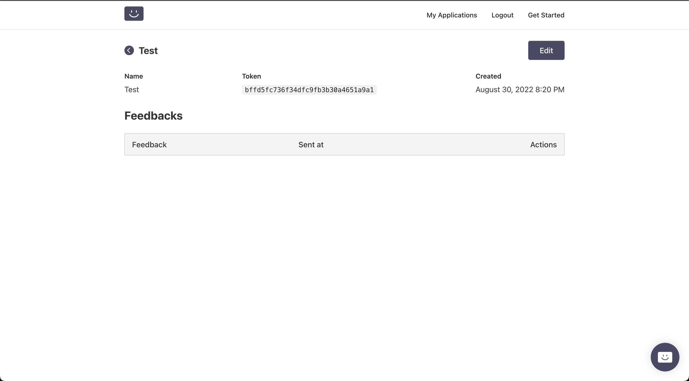

# Feedbacky 🖋
Getting feedback is great, but it's even better when it's combined with Feedbacky.
Feedbacky is a simple package that fastens your communication between your customers. Designed for you to implement, customize and publish easily.

>NOTE:  Since it’s not allowed to publish this project in public, I just published an example usage on [GitHub Pages](https://baris5d.github.io/feedbacky "").
## Getting Started
### 🔨 Installation
To get started with Feedbacky, you can simply install it via npm. 

> Since it’s a private package, you need to make sure that you have an access to its repository and configured your .npmrc as follows:

```bash

$ echo "@baris5d:registry=https://npm.pkg.github.com/baris5d" > .npmrc
$ npm i @baris5d/feedbacky--save

```

or

```bash

$ echo '"@baris5d:registry" "https://npm.pkg.github.com/baris5d"' > .yarnrc
$ yarn add @baris5d/feedbacky

```

or via CDN

```html
<link rel="stylesheet" href="./feedbacky.css" />
<script defer type="text/javascript" src="./feedbacky.js"></script>
```


### 📭 Feedbacky APIs
If you want to get benefit from Feedbacky component as a service,  you can follow the steps accordingly.
##### Deploy your own backend
> NOTE: Backend service is already available in public, you may pass this step if you don’t want to deploy your own backend service.

Feedbacky is an open source project, you can serve your own backend service in your own servers. If you want to use your own endpoints, you may find the installation guide [here]( "").

##### Create an account

##### Create your Application
In My Applications Page, you can create your first application that you want to use Feedbacky.

##### Copy your token
Once you create your application,  you may find yor application’s token from _detail_ page or in my _applications_ list. 


### 🥁 Usage

#### React App 

```javascript
import { Feedbacky } from 'feedbacky'
import 'feedbacky/dist/index.css'

ReactDOM.render(
	<React.StrictMode>
		<Feedbacky 
			token="<TOKEN>"
			// baseURL="<API_URL>"
            />
	</React.StrictMode>
)
```

#### CDN

```html
<link rel="stylesheet" href="./feedbacky.css" />
<script defer type="text/javascript" src="./feedbacky.js"></script>
<body>
<div id="feedbacky"></div>
</body>
<script>
	window.onload(() => {
		initFeedbacky({
			token="<TOKEN>"
			// baseURL="<API_URL>"
		})
	})
</script>
```

### 🗝 Parameters	

| Name           | Description                                                  | Type   | Optional |
|----------------|--------------------------------------------------------------|--------|----------|
| token          | Application token generated by service                       | string | no       |
| baseURL        | API endpoint that is used to save feedbacks<br>default: api.foo.bar/feedbacky | string | yes      |
| id             | Element ID that you want to inject Feedbacky<br>default: feedbacky | string | yes      |
| primaryColor   | Primary color that is used for backrgound and button color   | string | yes      |
| secondaryColor | Secondary color that is used for gradient                    | string | yes      |
| maxLength      | Max character length for feedback<br>default: 2000           | number | yes      |
| title          | Title that is shown on the modal<br>default: Feedback        | string | yes      |
| description    | Description that is shown over the message field<br>default: Share your thoughts with us | string | yes      |
| successMessage | Success message that is shown when user sends a feedback<br>default: Thanks for your feedback | string | yes      |
| zIndex         | Z-index value used by icon and modal<br>default: 99999       | number | yes      |

### Licence
[MIT](../LICENCE)
